# Web Services

A Web Service is a system that automatically supports machine-to-machine interactions, facilitating interoperability between heterogeneous systems. The implementation of a system of this type can take place using different architectural styles, including REST,
which is based on the use of HTTP methods, such as GET and POST, uniquely identifying resources through a URI. To define the interface of the reference web service, OpenAPI can be used that is a standard  to define structure and syntax of REST API.

## REST API Inventory

In this project APICUR.IO is been used in order to define REST API, using OpenAPI standard. 

In order to implements differents services of this project, there are 9 endpoints:

- /api/account
- /api/account/card
- /api/book
- /api/cart
- /api/catalog
- /api/checkout
- /api/login
- /api/order
- /api/order/shipping

Let's discuss about them

\newpage

### API /api/login

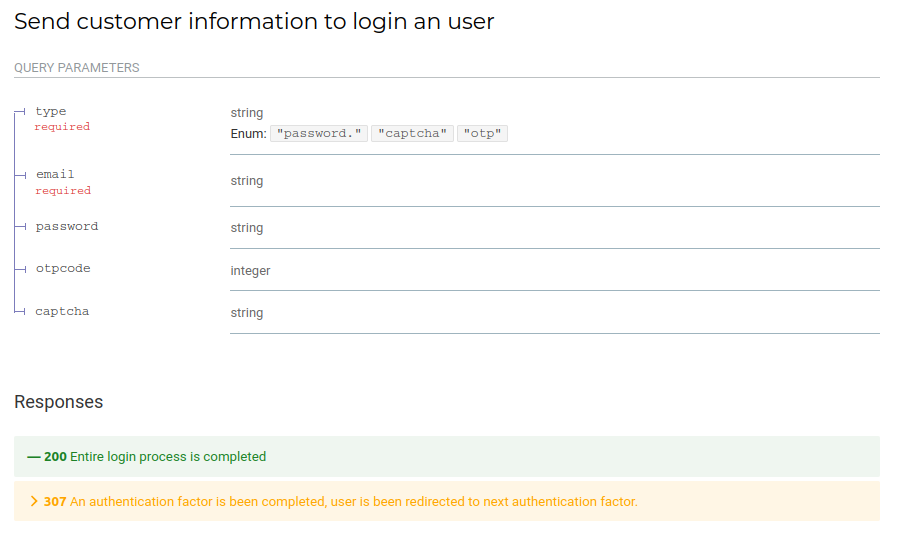

Using this API an user can login using multifactor authentication.

#### 200 OK

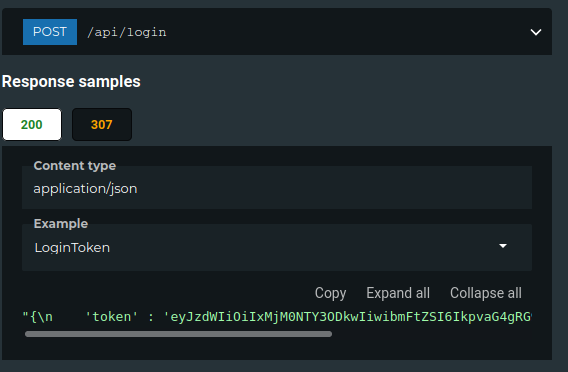

User have completed all process login and it obtain an JWT token to authenticate itself.

JWT Token is a signed token that contains public customer information and system signature to avoid crafting of illegal tokens.

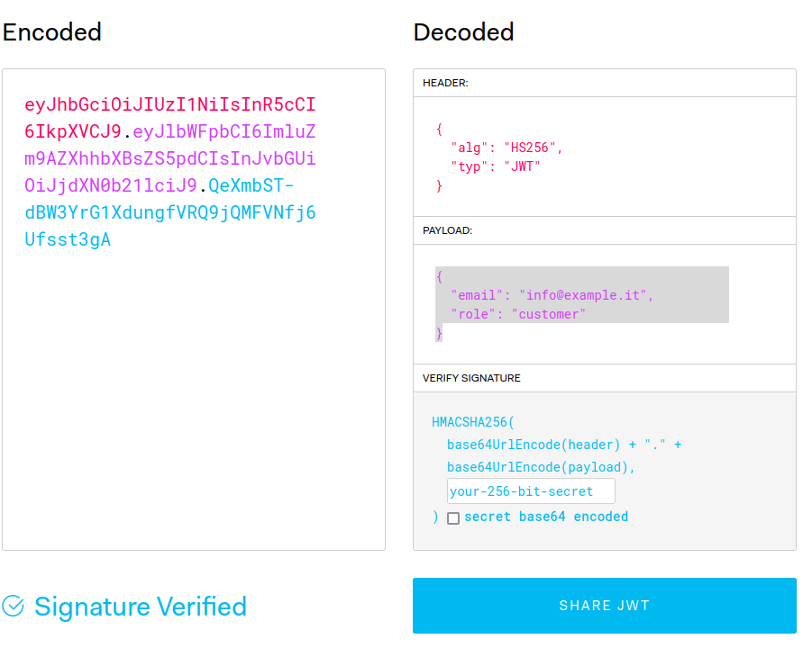

This token will be required for all process that require an authentication.

\newpage

#### 307 Temporary Redirect

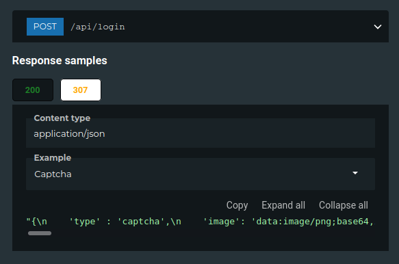

In this example user have input correct password and system replies sending captcha image to solve.

This method permits to handle multifactor login.

\newpage

### API /api/account

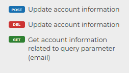

This endpoint permit different methods for different actions.

#### GET

Customer or administrator can get costumer details accounts. Note that token obtained in login process is required for customer or administrator identification,

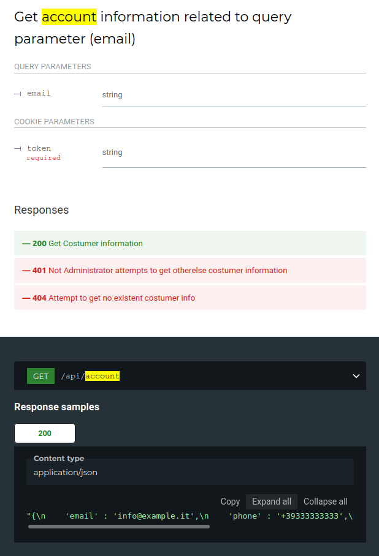

#### POST

Customer can update its customer details, note that password is not sended in clear but it is hashed in accord to GPDR (NF_2).

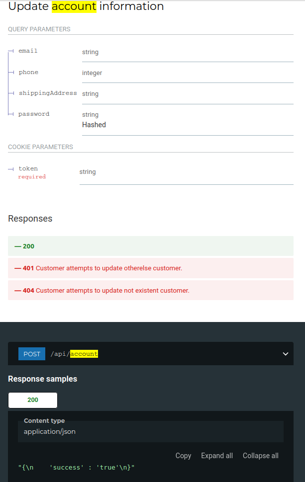

#### DELETE

Administrator can delete selected costumer account.

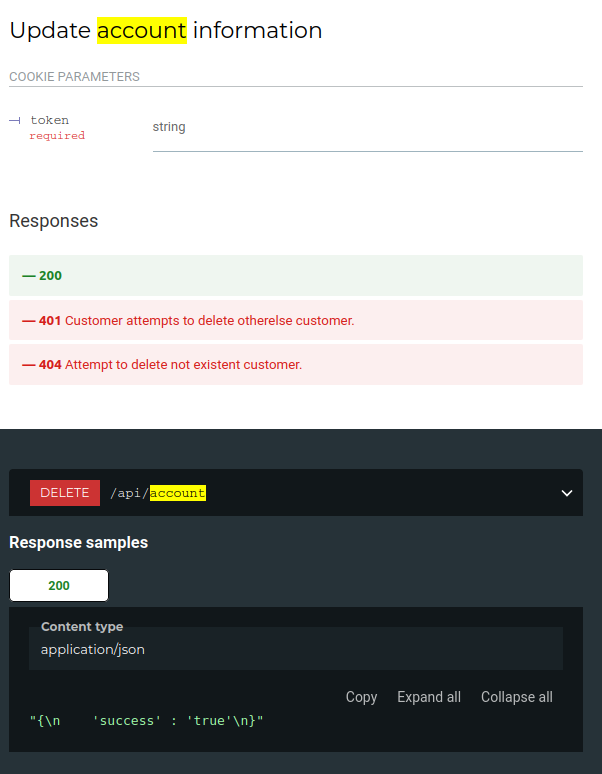

\newpage

### API /api/account/card

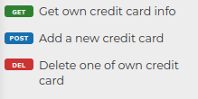

#### GET

Customer can get its credit card info, note that credit card is hidden to itself in order to improve security.

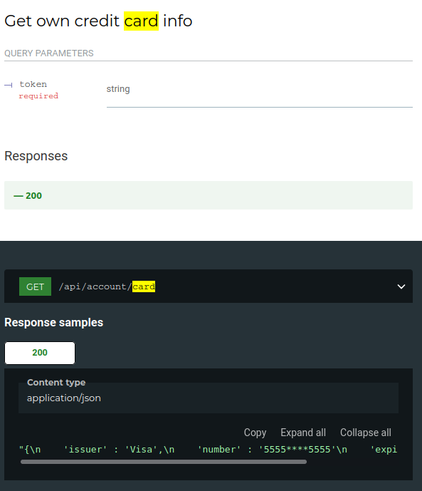

#### POST

Customer can add a credit card to its account specifing all required parameters.

#### DELETE

Customer can delete a credit card from its account specifing index.

\newpage

### API /api/book

#### GET

Any user can watch book information using specified query parameter

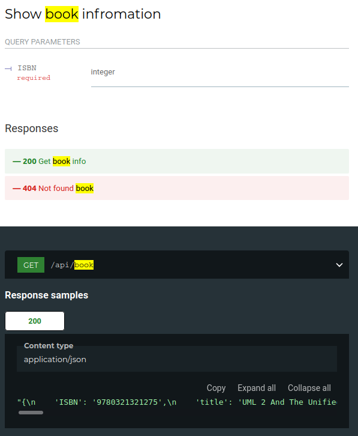

#### POST

Note there is a require parameter **action**, it is used by system to apply different action for different roles.

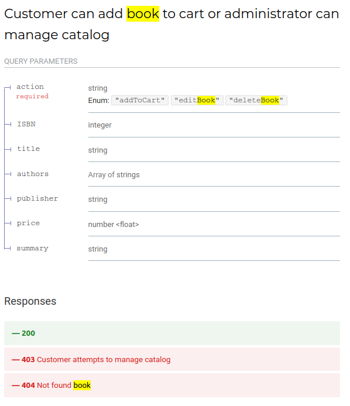

\newpage

### API /api/catalog

#### GET/POST

Any user can browse catalog using GET e POST requests to surf on catalog

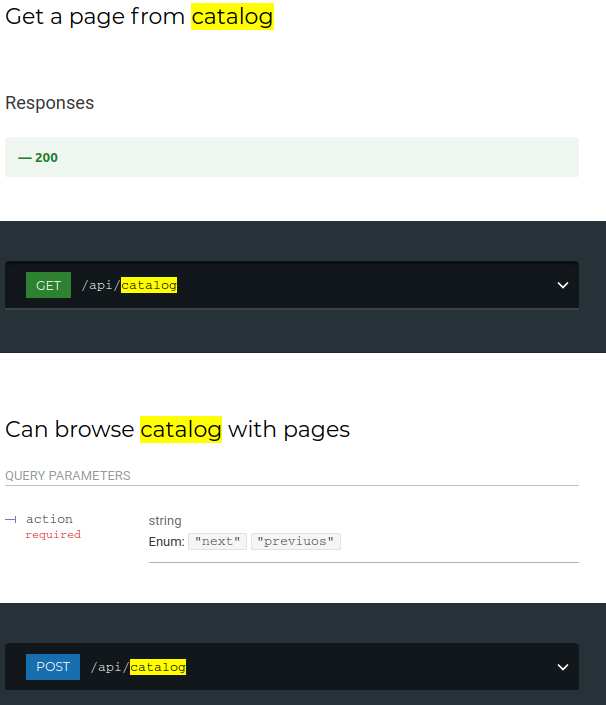

\newpage

### API /api/cart

#### GET/POST

Costumer can watch and manage its cart using GET/POST requests and query parameters.

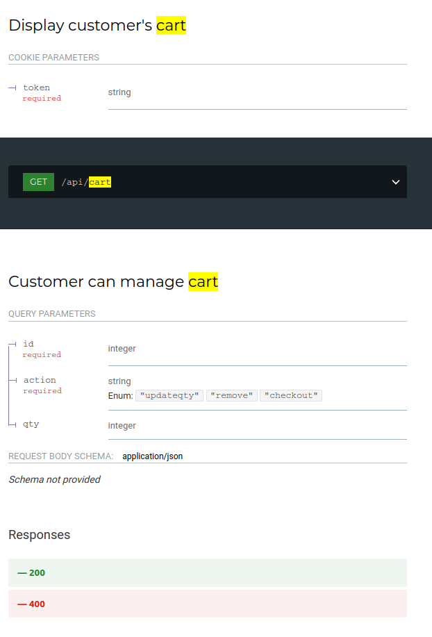

\newpage

### API /api/checkout

Customer try to checkout cart using a card selected by index, in response the System will reply *201 Created* if payment is successful else it will reply *400 Bad Request* showing error information to customer.

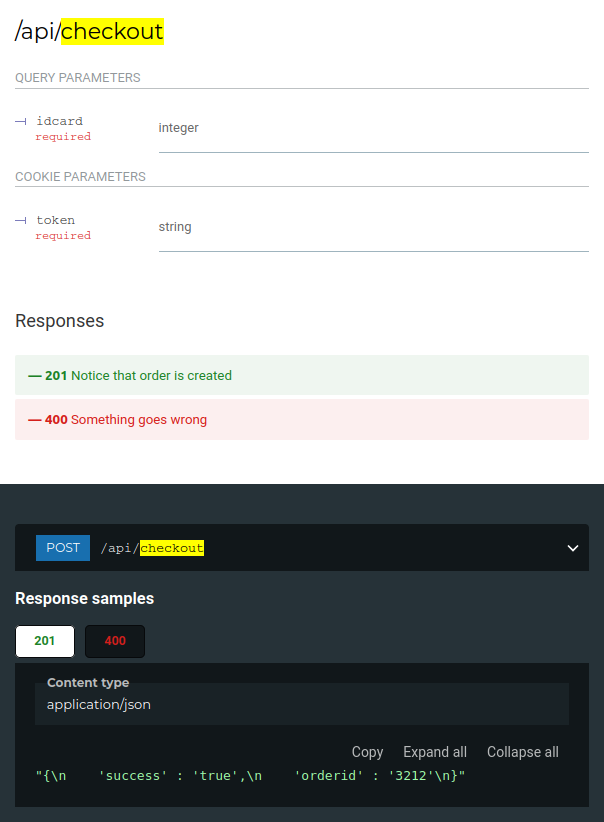

\newpage

### API /api/order

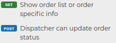

#### GET

Customer can get its entire order list if id parameter is not specified else it can get informations for a specific order identified by id

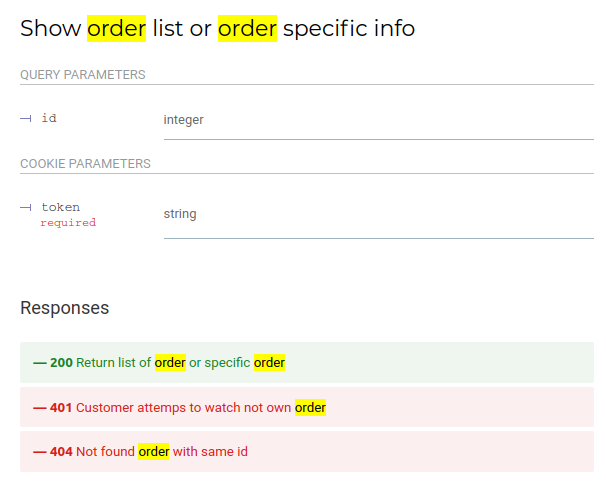

#### POST

Dispatcher can update order status specifing order id.

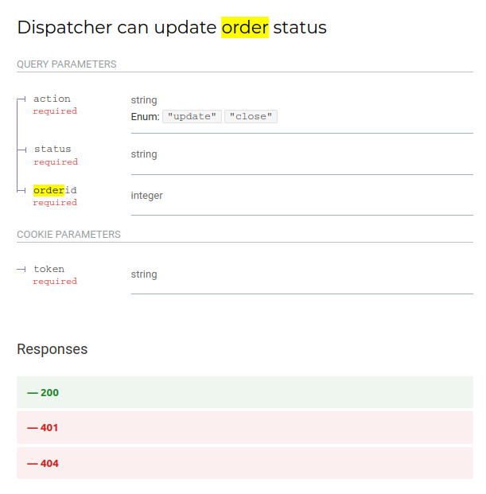

\newpage

### API /api/order/shipping

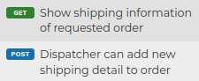

#### GET

Customer can get list of shipping information associated to orderid required parameter.

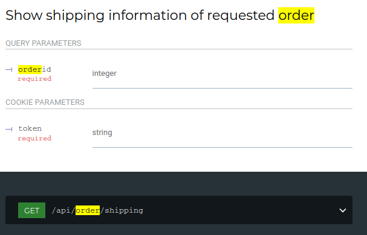

#### POST

Customer can update list of shipping information associated to orderid required parameter.

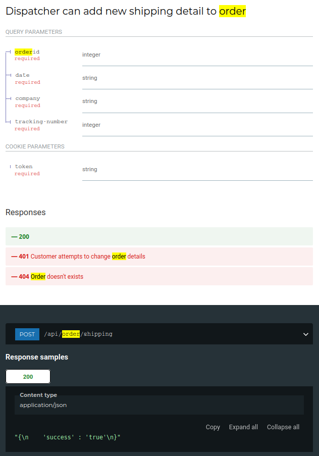

\newpage

