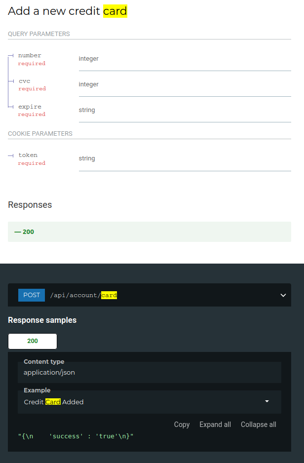
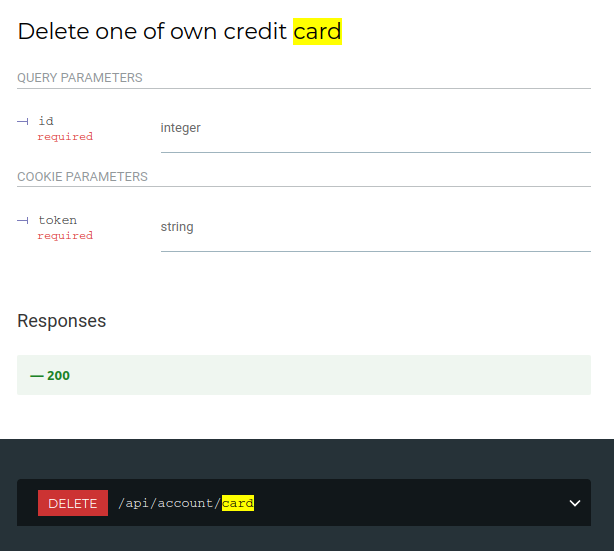

# Web Services

A Web Service is a system that automatically supports machine-to-machine interactions, facilitating interoperability between heterogeneous systems. The implementation of a system of this type can take place using different architectural styles, including REST,
which is based on the use of HTTP methods, such as GET and POST, uniquely identifying resources through a URI. To define the interface of the reference web service, OpenAPI can be used that is a standard  to define structure and syntax of REST API.

## REST API Inventory

In this project APICUR.IO is been used in order to define REST API, using OpenAPI standard. 

In order to implements differents services of this project, there are 9 endpoints:

- /api/account
- /api/account/card
- /api/book
- /api/cart
- /api/catalog
- /api/checkout
- /api/login
- /api/order
- /api/order/shipping

Let's discuss about them

\newpage

### API /api/login

Using this API an user can login using multifactor authentication.

#### 200 OK

User have completed all process login and it obtain an JWT token to authenticate itself.

JWT Token is a signed token that contains public customer information and system signature to avoid crafting of illegal tokens.

This token will be required for all process that require an authentication.

\newpage

#### 307 Temporary Redirect

In this example user have input correct password and system replies sending captcha image to solve.

This method permits to handle multifactor login.

\newpage

### API /api/account

This endpoint permit different methods for different actions.

#### GET

#### POST

#### DELETE

\newpage

### API /api/account/card

#### GET

#### POST

#### DELETE

\newpage

### API /api/book

#### GET

#### POST

\newpage

### API /api/catalog

#### GET/POST

\newpage

### API /api/cart

#### GET/POST

\newpage

### API /api/checkout

\newpage

### API /api/order

#### GET

#### POST

\newpage

### API /api/order/shipping

#### GET

#### POST

