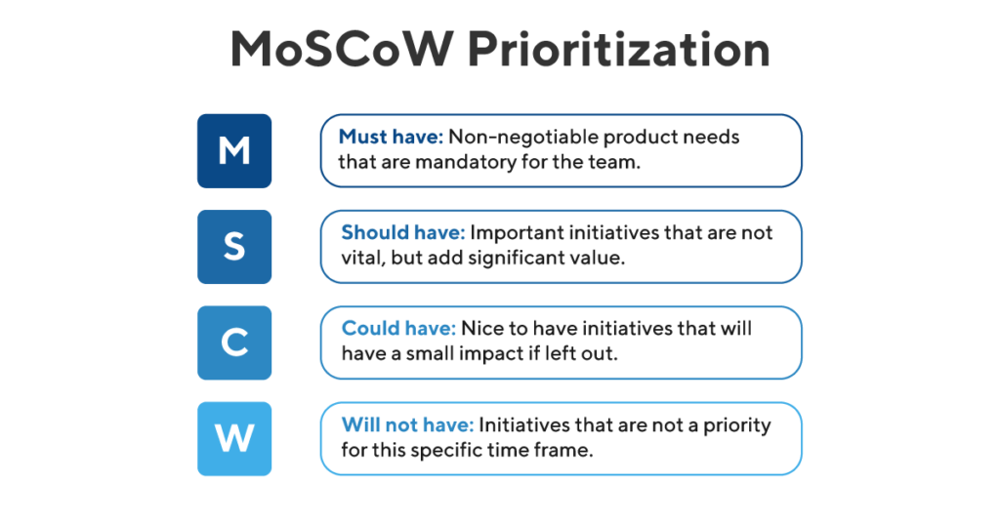

/newpage

# Requirement Software Analysis

## Glossary Project

| Terms | Definition |
| :---- | :--------- | 
| Catalog | A listing of all of the products that shop currently offers for sale. |
| Checkout | An electronic analogue of a real-world checkout in a supermarket. A place where customers can pay for the products in their shopping cart. |
| Credit card | A card such as VISA or Mastercard that can be used for paying for products. |
| Customer A party who buys products or services from Clear View Training Limited.
| Order | A document raised by a customer specifying one or more products that have been purchased. The order specifies the quantity of each product. Orders are passed to the Dispatch Department for processing. |
| Product | A book offered for sale. |
| Cart | An electronic analogue of a real-world shopping cart. A place where customers can store their items prior to purchase. |
| Browser | A program which allows users to browse the World Wide Web. |
| Captcha | A challange that requires to correctly evaluate a distorted image in order to determine that user is human. |
| OTP | A password that is valid for only one login session. |

\newpage

## MoSCoW Terminology

## Functional Requirements

The basic functional requirements are:

| ID       | Description  | Module  | 
| -------- |:------------ | :------- | 
|  RF_1    | System **must** allow the user to register. | Registration/Login | 
|  RF_2    | System **must** allow the user to login as customer. | Registration/Login |
| RF_3 | System **shall** allow the administrator to delete customers. | Registration/Login |  
|  RF_4    | System **must** shall collect customer information consisting of name, address, email address, phone number, credit card information. | Registration/Login | 
|  RF_5    | System **shall** allow the customer to view and edit its customer information. | Registration/Login |
|  RF_6    | System **must** display a list of all books of store to users. | Book Details | 
|  RF_7   | System **must** display detailed book description consisting of ISBN, name, author, publisher, cover image, summary, price to users. | Book Details | 
|  RF_8   | System **shall** accept all major credit cards. | Payment | 
|  RF_9   | System **must** validate payment with the credit card processing company. | Payment | 
|  RF_10   | System **must** allow the customer to choose payment method: credit cards or cash on delivery. | User Interface | 
|  RF_11   | System **must** allow the customer to place items into cart. | User Interface | 
|  RF_12   | System **must** allow the customer to remove items from cart. | User Interface | 
|  RF_13   | System **must** allow the customer to checkcout cart. | User Interface | 
|  RF_14   | System **must** allow the dispatch department to view all orders. | Orders |
|  RF_15   | System **shall** allow customers to view their order history. | Orders |
|  RF_16   | System **must** allow the administrator to add books to catalog | Stock Managament |
|  RF_17   | System **must** allow the administrator to delete books from catalog | Stock Management |
|  RF_18   | System **shall** track information about orders | Delivery&Tracking |
|  RF_19   | System **shall** display track information about customer order. | Delivery&Tracking |
|  RF_20   | System **must** allow the dispatch department to update state of order. | Delivery&Tracking |
| RF_21 | System **could** save the cart of last customer session. | Registration/Login |  

## Not-Functional Requirements

The basic not-function requirements are:

| ID       |Description  | Type |
| --------|:-------------| ---- |
|  NF_1   | System **must** use a browser as its user interface. | ComplianceTo-Standards |
|  NF_2   | System **must** collect costumer information in according to GPDR | ComplianceTo-Standards |
|  NF_3   | System **must** store sales transaction data. | Availability |
|  NF_4   | System **shall** use a multifactor authentication. | Security |

\newpage

## Use Case Model

### Actors

The table below contains brief semantics for the actors

| Actors | Description |
| :----- | :---------- |
| Administrator | A special user of the system who can manage shop and other costumers. |
| Credit Card Issuer | An external company that processes credit card transactions. |
| Customer | Authenticated user who can buy books from shop. |
| Dispatcher | Subject or systen who can manage order and shippment. |
| User | Someone who uses the system but who is not a customer. |

\newpage

### Use Case Diagram

\newpage

#### Use Case: Login

**ID**: **UC1**

**Actors**: 

- User

**Preconditions**:

- User is not logged on to the system.

**Flow of events**:

- 1 The scenario begins when the User selects “Login”.
- 2 While the User is not logged on:
  - 2.1 The System asks the User email and password.
  - 2.2 The User enters email and password.
  - 2.3 If email and password are correct:
    - 2.3.1 The System asks the User to solve a captcha
    - 2.3.2 The User enters captcha
    - 2.3.3 If captcha is correct
      - 2.3.3.1 The System sends OTP code to Customer's phone number:
      - 2.3.3.2 The User enters OTP code
      - 2.3.3.3 It OTP code is correct: 
      - 2.3.3.4 The System authenticates the User

**Postconditions**:

- User is a Customer

**Secondary Scenario**:

- 1 The scenario begins when the Customer selects “Log On”.
- 2 While the User is not logged on
  - 2.1 The System asks the User email and password.
  - 2.2 The User enters email and password.
  - 2.3 The email and/or password are wrong.
- 3 The System logs a security violation.

**Postcondition**:

- User is not logged in
- System log a security violation

\newpage

#### Use Case: Register

**ID**: **UC2**

**Actors**: 

- User

**Preconditions**:

- User is not logged on to the system.

**Flow of events**:

- 1 The use case begins when the User selects “Register”.
- 2 The System asks the User to enter a email and password.
- 3 The User enters the requested information.
- 4 The System checks to see if the email is unique and the password is valid.
- 5 While the email is not unique or the password is invalid
  - 5.1 The System asks for a new email and/or password.
- 6 The System asks the Customer for the following information: name and address, phone number, credit card details (optionally).
- 7 The User enters the requested information.
- 8 While information is missing
  - 8.1 The System asks the User for the missing information.
  - 8.2 The User enters the missing information.
- 9 The System confirms that the User information has been accepted

**Postcondition**:

- 1 The System has saved the Costumer details.
- 2 The Customer is assigned a username and password.
- 3 The Customer is assigned a unique customer identifier.

\newpage

#### Use Case: Update Account

**ID**: **UC3**

**Actors**: 

- Costumer

**Preconditions**:

- None

**Flow of events**:

- 1 The use case begins when the Costumer selects “Modify Account”.
- 2 The system displays the customer details including name and address, email address, phone number, credit card details.
- 3 The Customer select a field and changes its value.
- 4 The Costumer selects "Save Changes"
- 5 While new informations are invalid
  - 5.1 System asks to insert correct informations
  - 5.2 The Costumer select incorrect informations and changes its value
  - 5.3 The Costumer selects "Save Changes"
- 6 The System confirms the changes

**Postcondition**:

- 1 The Customer’s details have been updated.

**Secondary Scenario**:
- 1 The use case begins when the Costumer selects “Modify Account”.
- 2 The system displays the customer details including name and address, email address, phone number, credit card details.
- 3 The Customer select a field and changes its value.
- 4 The Costumer exits.

**Postcondition**:

- 1 The Customer’s details have not changes.

\newpage

#### Use Case: Delete Account

**ID**: **UC4**

**Actors**: 

- Administrator

**Preconditions**:

- None.

**Flow of events**:

- 1 The use case begins when the Adminstrator selects “Delete Account”.
- 2 The System asks for a email
- 3 The Adminstrator enters the email
- 4 The System displays Customer details related to email
- 5 The Adminstrator confirms the deletion

**Postcondition**:

- 1 The Customer’s account has been deleted.

\newpage

#### Use Case: Add Item To Cart

**ID**: **UC5**

**Actors**: 

- Customer

**Preconditions**:

- None

**Flow of events**:

- 1 The Customer selects a product
- 2 The Customer selects “Add Item”.
- 3 The system adds the item to the Customer’s shopping cart.

**Postcondition**:

- 1 A product has been added to the Customer’s cart.

\newpage

#### Use Case: Display Cart

**ID**: **UC6**

**Actors**: 

- Customer

**Preconditions**:

- None

**Flow of events**:

- 1 The Customer selects “Display Cart”.
- 2 If there are no items in the cart
  - 2.1 The system tells the Customer that the cart is empty.
  - 2.2 The use case terminates
- 3 For each book in the cart
   - 3.1 The System displays the book detail,  quantity, unit price and total price.
- extension point: manageCart
- extension point: checkout

**Postcondition**:

- None

\newpage

#### Use Case: Manage Cart

**ID**: **UC7**

**Actors**: 

- Customer

**Preconditions**:

- 1 The System is displaying the shopping cart.

**Flow of events**:

- 1 While the Customer is updating the cart
  - 1.1 The Customer selects an item in the cart.
  - 1.2 If the Customer selects “Remove Item”
    - 1.2.1 The System removes the selected item from the cart.
  - 1.3 If the Customer enters a new quantity for the selected item
    - 1.3.1 The System updates the quantity for the selected item.

**Postcondition**:

- None

\newpage

#### Use Case: Checkout

**ID**: **UC8**

**Actors**: 

- Customer

**Preconditions**:

- None 

**Flow of events**:

- 1 The use case begins when the Customer selects “Checkout”.
- 2 The System presents the final order to the Customer. The order includes an order line for each book that shows the product name, the quantity, the unit price, the total price for that quantity. The order also includes the shipping address of the Customer and the total cost of the order including postage and packing costs.
- 3 The System asks the Customer to accept or decline the order
- 4 The Customer accepts the order.
- 5 The System asks to choose payment method
- 6 If Customer select online payment
  - 6.1  include(AcceptPaymentByCard)
- 7 If Costumer select cash on delivery
  - 7.1 The System add service's cost
  - 7.3 The order status has been set to pending.
  - 7.2 The order has been sent to the Dispatcher.

**Postcondition**:

- 1 The Customer has accepted the order

\newpage

#### Use Case: Payment By Card

**ID**: **UC9**

**Actors**: 

- Customer
- Credit Card Issuer

**Preconditions**:

- None 

**Flow of events**:

- 1 The use case begins when the Customer accepts the order.
- 2 The System retrieves the Customer’s credit card details.
- 3 The System sends a message to the Credit Card Issuer that includes: merchant identifier, merchant authentication, name on card, number of card, expiry date of card, amount of transaction.
- 4 The Credit Card Issuer authorises the transaction.
- 5 The System notifies the Customer that the card transaction has been accepted.
- 6 The System gives the Customer an order reference number for tracking the order.
- 7 The System sends the order to the Dispatcher.
- 8 The System changes the order’s state to pending.
- 9 The System displays an order confirmation that the Customer may print out.

**Postcondition**:

- 1 The order status has been set to pending.
- 2 The Customer’s credit card has been debited by the appropriate amount.
- 3 The order has been sent to the Dispatcher.

**Secondary Scenario**:

- 1 The secondary scenario begins after step 3 of the primary scenario
- 2 The Credit Card Issue doesn't allow transaction
- 3 The system displays a message telling the Customer that their order can’t be processed.
- 4 Order is deleted

\newpage

#### Use Case: Browse Books

**ID**: **UC10**

**Actors**: 

- Customer

**Preconditions**:

- 1 A set of books has been identified for browsing 

**Flow of events**:

- 1 The system displays a page containing a maximum of 10 books. This page includes the following summary information for each book: title, author, publisher, price.
- 2 While the Customer is browsing
- 2.1 If there are more products to display
  - 2.1.1 The Customer may select “Next” to view the next page of products.
- 2.2 If the Customer is not on the first page of products
  - 2.2.1 The Customer may select “Previous” to view the previous page of products.

extension point: showbook

**Postcondition**:

None

\newpage

#### Use Case: Show Book

**ID**: **UC11**

**Actors**: 

- User

**Preconditions**:

- None

**Flow of events**:

- 1 The use case begins when the Customer select a book.
- 2 The System displays book's information: ISBN, name, author, publisher, price and stock avaibility.

extension point: buybook

**Postcondition**:

None

\newpage

#### Use Case: Find Books

**ID**: **UC12**

**Actors**: 

- User

**Preconditions**:

- None

**Flow of events**:

- 1 The Customer selects “Find Book”.
- 2 The System asks the Customer for book search criteria that consist of one or more of the following: title, author, ISBN, category.
- 3 The Customer enters the search criteria.
- 4 The System searches for books that match the Customer's criteria.
- 5 If the system finds some books
  - 5.1 include(Browse Books).
- 6 Else
  - 6.1 The System tells the Customer that no matching books were found.

**Postcondition**:

None

\newpage

#### Use Case: Add Book

**ID**: **UC13**

**Actors**: 

- Administrator

**Preconditions**:

- None

**Flow of events**:

- 1 The use case begins when the Administrator selects “Add Book.
- 2 The System asks the Shopkeeper to enter the following product information: ISBN,title, category, authors, publisher, price, description, image.
- 3 The Administrator enters the requested information..
- 4 The System adds the new book to the catalog.

**Postcondition**:

- 1 A new book has been added to the catalog.

\newpage

#### Use Case: Delete Book

**ID**: **UC14**

**Actors**: 

- Administrator

**Preconditions**:

- None

**Flow of events**:

- 1 The use case begins when the Administrator selects “Delete Product”.
- 2 The System asks the Shopkeeper for the book identifier (ISBN) of the book to delete..
- 3 The Administrator enters the requested information..
- 4 The System displays the book details.
- 5 The Administrator confirms the deletion.
- 6 The System deletes the book from the catalog.

**Postcondition**:

- 1 A book has been deleted to the catalog.

\newpage

## Class Diagram

This is a first-cut use case diagram

\newpage

## Use Case Realization

The process of use case realization involves demonstrating how the analysis classes that
you have identified interact together to realize the behavior specified by the use cases. Use
case realizations consist of:
- Detailed analysis class diagrams
-  Sequence and communication diagrams for the use cases.

### Sequence diagrams

#### UC1 - Login

#### UC2 - Register

\newpage

#### UC3 - UpdateAccount

#### UC4 - DeleteAccount

\newpage

#### UC5 - AddItemToCart

#### UC6 - DisplayCart

\newpage

#### UC7 - ManageCart

#### UC8 - Checkout

\newpage

#### UC9 - PaymentByCard

#### UC10 - BrowseBooks

\newpage

#### UC10 - BrowseBooks

\newpage

#### UC11 - ShowBook

#### UC12 - FindBooks

\newpage

#### UC13 - AddBook

#### UC14 - DeleteBook

\newpage
