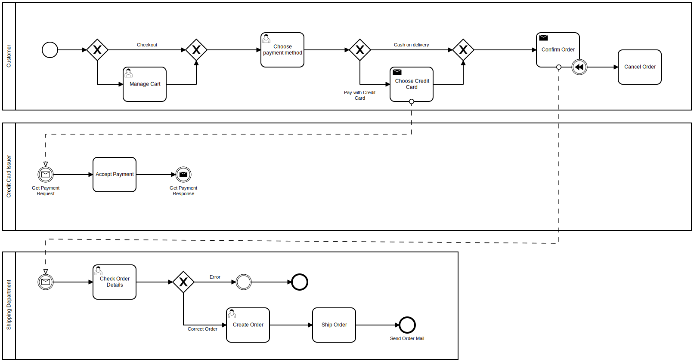

# Business Process Model and Notation

Business Process Model and Notation (**BPMN**) is a graphical representation for specifying business processes in a business process model. 

Following process is business process of creation of an order by user. Particulary after possibly modifying  cart, the
customer selects the payment method.

If credit card is chosen as payment method then Credit Card Issuer analyze request to accept payment. If there are not problems issuer will reply a valid answer, else a not valid answer.

If customer receive a not valid answer the process will not continue.

If costumer choose "Cash On Delivery" payment method or choosing "Credit Card" payment method, issuer accept payment, then it can confirm order or not.

If order is confirmed the shipping department will check order details and shipping detail for finally create order and send a mail to customer.

\newpage

