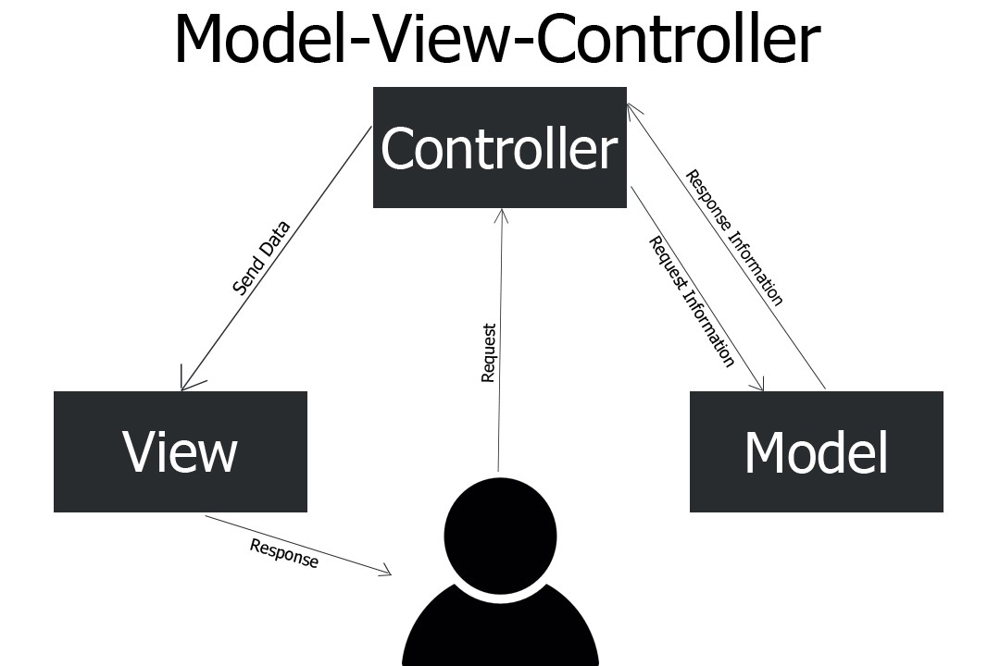

# Design

## Class Diagram

In the design phase architect decided to use :

- MVC Pattern as architectural pattern to design design class
- Singleton, Memento and Chain of Responsability pattern in order to satisfy software requirements.

Below there is entire class diagram that will be discussed in next sections.

\newpage

## Patterns

### MVC Pattern

Model–view–controller (MVC) is a software design pattern commonly used for developing user interfaces that divide the related program logic into three interconnected elements. This is done to separate internal representations of information from the ways information is presented to and accepted from the user.

#### Model
The model represents the data and logic of the app. A model can have a to-one and to-many relationships to other models. This is where the data is manipulated and/or saved. 

#### View

The view is the only part of the app the user interacts with directly. It is attached to the model and in turn displays the model’s data. It may also update the model by sending appropriate messages to it as long as it matches up with the terminology in the model. 

#### Controller

The controller is the go-between for models and views. It provides users with forms and menus for inputing information. The controller receives users input and translates it, and then passes those inputs on to one or more of the views. It interprets all user actions and goes between model and view to connect them.

### Singleton

Singleton is a creational design pattern that lets you ensure that a class has only one instance, while providing a global access point to this instance.

The Singleton class declares the static method getInstance that returns the same instance of its own class.

The Singleton’s constructor should be hidden from the client code. Calling the getInstance method should be the only way of getting the Singleton object.

In this project shop catalog is oblivious a object with a single instance :

### Memento

Memento is a behavioral design pattern that lets you save and restore the previous state of an object without revealing the details of its implementation.

1. The Originator class can produce snapshots of its own state, as well as restore its state from snapshots when needed.

2. The Memento is a value object that acts as a snapshot of the originator’s state. 

3. The Caretaker knows not only “when” and “why” to capture the originator’s state, but also when the state should be restored.

4. A caretaker can keep track of the originator’s history by storing a stack of mementos. When the originator has to travel back in history, the caretaker fetches the topmost memento from the stack and passes it to the originator’s restoration method.

In this project, Function requiremente RF_21 aims to save and restore cart of last customer session, momento pattern looks useful for this requirement. 

### Chain Of Responsability

Chain of Responsibility is a behavioral design pattern that lets you pass requests along a chain of handlers. Upon receiving a request, each handler decides either to process the request or to pass it to the next handler in the chain.

- The Handler declares the interface, common for all concrete handlers. It usually contains just a single method for handling requests, but sometimes it may also have another method for setting the next handler on the chain.

- The Base Handler is an optional class where you can put the boilerplate code that’s common to all handler classes. Usually, this class defines a field for storing a reference to the next handler. The clients can build a chain by passing a handler to the constructor or setter of the previous handler. The class may also implement the default handling behavior: it can pass execution to the next handler after checking for its existence.

- Concrete Handlers contain the actual code for processing requests. Upon receiving a request, each handler must decide whether to process it and, additionally, whether to pass it along the chain.

In this project, not functional requirement NF_4 asks to use a multifactor authentication for access control, using this pattern a sequence of authentication factor can be implemented easily.

## Sequence Diagram

In order to validate class diagram, some sequence diagram are showed up

