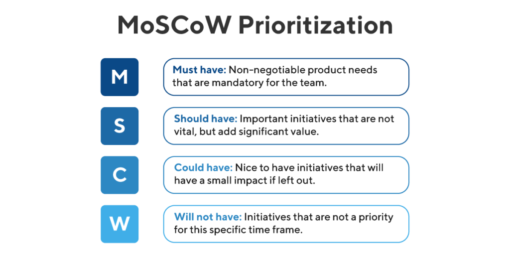
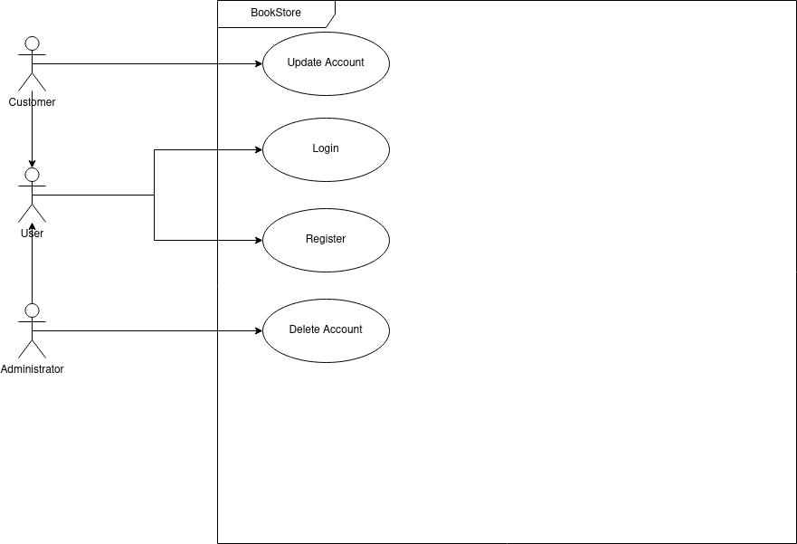
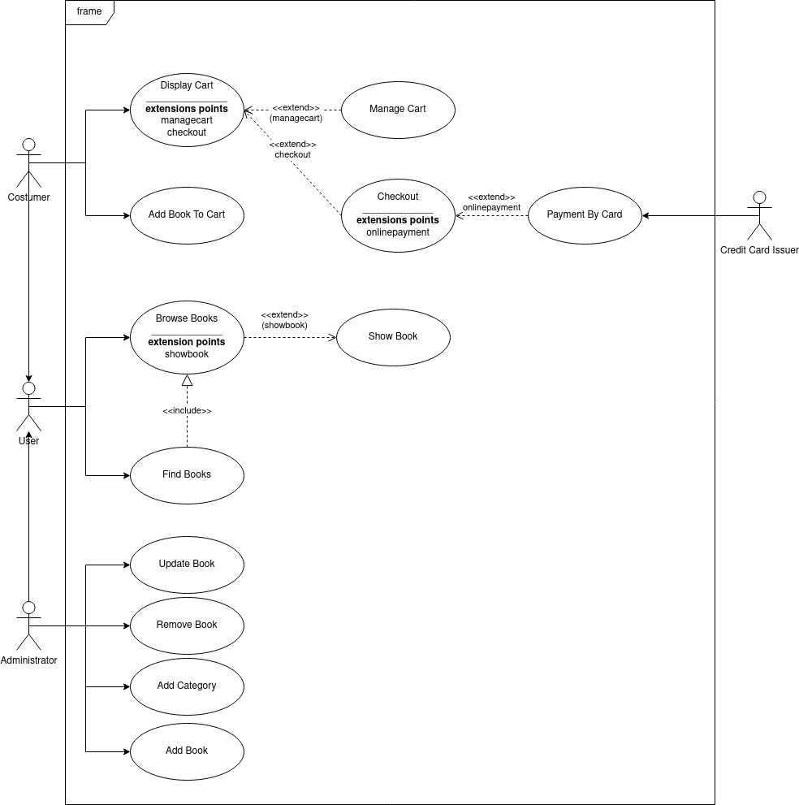

/newpage

# Software Requirements Specification

## Glossary

### General Glossary
| Term | Definition |
| ---- | ---------- |
| Cart |
| Checkout |
| Catalog | 
| Credit Card |
| Customer |
| Dispatch System |
| Order |
| OTP  |
| ISBN |
| RBAC |
| User |

\newpage

### MoSCoW Terminology

## Functional Requirements

The basic functional requirements are:

| ID       | Description  | Module  | 
| -------- |:------------ | :------- | 
|  RF_1    | System **must** allow the user to register. | Registration/Login | 
|  RF_2    | System **must** allow the user to login as customer. | Registration/Login |
|  RF_4    | System **must** shall collect customer information consisting of name, address, email address, phone number, credit card information. | Registration/Login | 
|  RF_5    | System **must** allow  the customer to view and edit its customer information. | Registration/Login | 
|  RF_6    | System **shall** authenticate costumers with password to viewing outstanding orders, viewing customer information and write feedback for a book. | Registration/Login | 
|  RF_7    | System **shall** authenticate costumers with OTP to making payment or edit customer information. | Registration/Login | 
|  RF_8    | System **must** display a list of all books of store to users. | Book Details | 
|  RF_9    | System **must** organise the list of books by category. | Book Details | 
|  RF_10   | System **must** display detailed book description consisting of ISBN, name, author, publisher, cover image, summary, price to users. | Book Details | 
|  RF_11   | System **must** display book's feedbacks to users. | Book Details | 
|  RF_12   | System **must** accept all major credit cards. | Payment | 
|  RF_13   | System **shall** validate payment with the credit card processing company. | Payment | 
|  RF_14   | System **must** allow the customer to choose payment method: credit cards or cash on delivery. | User Interface | 
|  RF_15   | System **must** allow the customer to place items into cart. | User Interface | 
|  RF_16   | System **must** allow the customer to remove items from cart. | User Interface | 
|  RF_17   | System **must** allow the customer to checkcout cart. | User Interface | 
|  RF_18   | System **must** allow the dispatch department to view all orders. | Orders |
|  RF_19   | System **shall** allow customers to view their order history. | Orders |
|  RF_21   | System **shall** allow the administrator to add books to catalog | Stock Managament |
|  RF_22   | System **shall** allow the administrator to delete books from catalog | Stock Management |
|  RF_23   | System **shall** display quantity of book in stock. | Stock Management |
|  RF_24   | System **shall** allow the administrator to update stock | Stock Management |
|  RF_25   | System **shall** track information about orders | Delivery&Tracking |
|  RF_26   | System **shall** display track information about customer order. | Delivery&Tracking |
|  RF_27   | System **shall** allow the dispatch department to update state of order. | Delivery&Tracking |

## Not-Functional Requirements

The basic not-function requirements are:

| ID       |Description  | Type |
| --------|:-------------| ---- |
|  NF_1   | System **shall** use a browser as its user interface. | ComplianceTo-Standards |
|  NF_2   | System **shall** collect costumer information in according to GPDR | ComplianceTo-Standards |
|  NF_3   | System **shall** store sales transaction data. | Availability |
|  NF_4   | System **could** use a RBAC system. | Security |

\newpage

## Use Case Model

### Actors

The table below contains brief semantics for the actors

| Actors | Description |
| :----- | :---------- |
| Customer | |
| User | |
| Administrator | |

### Use Case Diagram 1

\newpage

#### Use Case: Login

**ID**: **UC1**

**Actors**: 

- User

**Preconditions**:

- User is not logged on to the system.

**Flow of events**:

- 1 The scenario begins when the User selects “Login”.
- 2 While the User is not logged on and the number of authentication attempts is less than or equal to three:
  - 2.1 The System asks the User username and password.
  - 2.2 The User enters username and password.
  - 2.3 The username and password are correct.
- 3 The System authenticates the User

**Postconditions**:

- User is a Customer or an Administrator

**Secondary Scenario**:

- 1 The scenario begins when the Customer selects “Log On”.
- 2 While the User is not logged on and the number of authentication attempts is less than or equal to three
  - 2.1 The System asks the User username and password.
  - 2.2 The User enters username and password.
  - 2.3 The username and/or password are wrong.
- 3 The System logs a security violation.

**Postcondition**:

- User is not logged in
- System log a security violation

\newpage

#### Use Case: Register

**ID**: **UC2**

**Actors**: 

- User

**Preconditions**:

- User is not logged on to the system.

**Flow of events**:

- 1 The use case begins when the User selects “Register”.
- 2 The System asks the User to enter a username and password.
- 3 The Customer enters the requested information.
- 4 The System checks to see if the username is available and the password is valid.
- 5 While the username is not available or the password is invalid
  - 5.1 The System asks for a new username and/or password.
- 6 The system asks the Customer for the following information: name and address, email address, phone number, credit card details.
- 7 The Customer enters the requested information.
- 8 While information is missing
  - 8.1 The System asks the Customer for the missing information.
  - 8.2 The User enters the missing information.
9 The System confirms that the User information has been accepted

**Postcondition**:

- 1 The System has saved the Costumer details.
- 2 The Customer is assigned a username and password.
- 3 The Customer is assigned a unique customer identifier.

\newpage

#### Use Case: Update Account

**ID**: **UC3**

**Actors**: 

- Costumer

**Preconditions**:

- None

**Flow of events**:

- 1 The use case begins when the Costumer selects “Modify Account”.
- 2 The system displays the customer details including name and address, email address, phone number, credit card details.
- 3 The Customer select a field and changes its value.
- 4 The Costumer selects "Save Changes"
- 5 While new informations are invalid
  - 5.1 System asks to insert correct informations
  - 5.2 The Costumer select incorrect informations and changes its value
  - 5.3 The Costumer selects "Save Changes"
- 6 The System confirms the changes

**Postcondition**:

- 1 The Customer’s details have been updated.

**Secondary Scenario**:
- 1 The use case begins when the Costumer selects “Modify Account”.
- 2 The system displays the customer details including name and address, email address, phone number, credit card details.
- 3 The Customer select a field and changes its value.
- 4 The Costumer exits.

**Postcondition**:

- 1 The Customer’s details have not changes.

\newpage

#### Use Case: Delete Account

**ID**: **UC4**

**Actors**: 

- Administrator

**Preconditions**:

- None.

**Flow of events**:

- 1 The use case begins when the Adminstrator selects “Delete Account”.
- 2 The System asks for a username
- 3 The Adminstrator enters the username
- 4 The System displays account details
- 5 The Adminstrator confirms the deletion

**Postcondition**:

- 1 The Customer’s account has been deleted.

\newpage

### Use Case Diagram 2

\newpage

#### Use Case: Add Item To Cart

**ID**: **UC5**

**Actors**: 

- Customer

**Preconditions**:

- None

**Flow of events**:

- 1 The Customer selects a product
- 2 The Customer selects “Add Item”.
- 3 The system adds the item to the Customer’s shopping cart.

**Postcondition**:

- 1 A product has been added to the Customer’s cart.

\newpage

#### Use Case: Display Cart

**ID**: **UC6**

**Actors**: 

- Customer

**Preconditions**:

- None

**Flow of events**:

- 1 The Customer selects “Display Cart”.
- 2 If there are no items in the cart
  - 2.1 The system tells the Customer that the cart is empty.
  - 2.2 The use case terminates
- 3 For each book in the cart
   - 3.1 The System displays the book detail,  quantity, unit price and total price.
- extension point: manageCart
- extension point: checkout

**Postcondition**:

- None

\newpage

#### Use Case: Manage Cart

**ID**: **UC7**

**Actors**: 

- Customer

**Preconditions**:

- 1 The System is displaying the shopping cart.

**Flow of events**:

- 1 While the Customer is updating the cart
  - 1.1 The Customer selects an item in the cart.
  - 1.2 If the Customer selects “Remove Item”
    - 1.2.1 The System removes the selected item from the cart.
  - 1.3 If the Customer enters a new quantity for the selected item
    - 1.3.1 The System updates the quantity for the selected item.

**Postcondition**:

- None

\newpage

#### Use Case: Checkout

**ID**: **UC8**

**Actors**: 

- Customer

**Preconditions**:

- None 

**Flow of events**:

- 1 The use case begins when the Customer selects “Checkout”.
- 2 The System presents the final order to the Customer. The order includes an order line for each book that shows the product name, the quantity, the unit price, the total price for that quantity. The order also includes the shipping address of the Customer and the total cost of the order including tax and postage and packing.
- 3 The System asks the Customer to accept or decline the order
- 4 The Customer accepts the order.
- 5 The System asks to choose payment method
- 6 If Customer select online payment
  - 6.1  include(AcceptPaymentByCard)
- 7 If Costumer select cash on delivery
  - 7.1 The System add service's cost
  - 7.3 The order status has been set to pending.
  - 7.2 The order has been sent to the Dispatcher.

**Postcondition**:

- 1 The Customer has accepted the order

\newpage

#### Use Case: Payment By Card

**ID**: **UC9**

**Actors**: 

- Customer
- Credit Card Issuer

**Preconditions**:

- None 

**Flow of events**:

- 1 The use case begins when the Customer accepts the order.
- 2 The System retrieves the Customer’s credit card details.
- 3 The system sends a message to the Credit Card Issuer that includes: merchant identifier, merchant authentication, name on card, number of card, expiry date of card, amount of transaction.
- 4 The Credit Card Issuer authorises the transaction.
- 5 The System notifies the Customer that the card transaction has been accepted.
- 6 The System gives the Customer an order reference number for tracking the order.
- 7 The System sends the order to the Dispatcher.
- 8 The System changes the order’s state to pending.
- 9 The System displays an order confirmation that the Customer may print out.

**Postcondition**:

- 1 The order status has been set to pending.
- 2 The Customer’s credit card has been debited by the appropriate amount.
- 3 The order has been sent to the Dispatcher.

**Secondary Scenario**:

- 1 The secondary scenario begins after step 3 of the primary scenario
- 2 The Credit Card Issue doesn't allow transaction
- 3 The system displays a message telling the Customer that their order can’t be processed.
- 4 Order is deleted

\newpage

#### Use Case: Browse Books

**ID**: **UC10**

**Actors**: 

- Customer

**Preconditions**:

- 1. A set of books has been identified for browsing 

**Flow of events**:

- 1 The system displays a page containing a maximum of 10 books. This page includes the following summary information for each book: title, author, publisher, price.
- 2 While the Customer is browsing
- 2.1 If there are more products to display
  - 2.1.1 The Customer may select “Next” to view the next page of products.
- 2.2 If the Customer is not on the first page of products
  - 2.2.1 The Customer may select “Previous” to view the previous page of products.
extension point: showbook

**Postcondition**:

None
